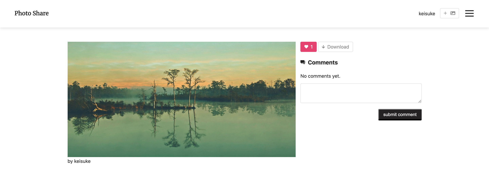

# イメージ
トップページ 
  

詳細ページ 
  

# 概要
作成期間：1週間経過 (2020/08/08 時点) 
お気に入りの写真を投稿してシェアできるWEBアプリです。  

# コメント
LaravelとVueを学びたいと思い、以下のサイトを参考に作成しました。 
アプリ作成を通して、Vuexやコンポーネントの仕組みについて更に理解を深めることができました。  

# リンク
・写真共有アプリケーション 
&emsp;<http://54.178.99.211/>

・参考にしたサイト
&emsp;[Vue + Vue Router + Vuex + Laravel チュートリアル（全16回）](https://qiita.com/MasahiroHarada/items/2597bd6973a45f92e1e8) 
&emsp;[Laravel × CircleCI × AWS で CI/CDパイプラインの構築方法を学ぶ）](https://www.techpit.jp/courses/78)  

# 機能
ログイン 
ユーザー登録 
写真投稿 
コメント投稿 
イイね 
ダウンロード 
ページネーション  

# 言語
HTML 
CSS 
Javascript 
PHP&ensp;/&ensp;7.2 
MySQL&ensp;/&ensp;5.7  

# フレームワーク
Vue.js&ensp;/&ensp;2.6 
Laravel&ensp;/&ensp;6.1  

# 開発環境
Git&ensp;/&ensp;2.23 
Node&ensp;/&ensp;12.16 
Nginx&ensp;/&ensp;1.17 
Docker&ensp;/&ensp;19.03 
CircleCI 
AmazonLinux2 
AWS(EC2、RDS、S3、CodeDeploy) 
VisualStudio&ensp;/&ensp;1.45.1 
MacOS Catalina&ensp;/&ensp;10.15.4