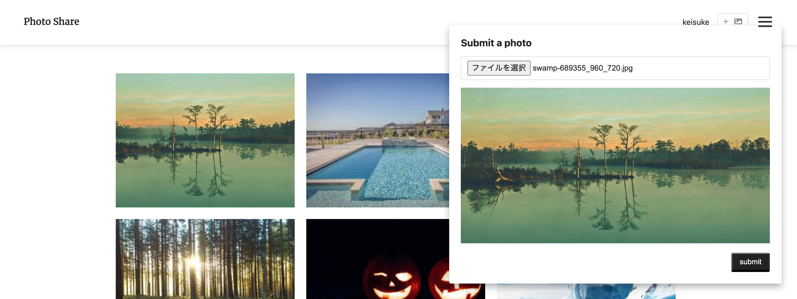

# イメージ
トップページ 
 

詳細ページ 
 

写真投稿 
 

※ レスポンシブに対応させました( iPhone / iPad )  

# 概要
作成期間&nbsp;：&nbsp;１ヶ月&nbsp;( 2020/09/04 ) 
お気に入りの写真を投稿してシェアできるWEBアプリケーションです。  

# コメント
フロントエンドやバックエンドについてバランスよく学習できるサイトを参考に作成しました。 
また、アプリケーションの作成を通してJavascriptのフレームワークについての理解を深めることができました。  

# リンク
・写真共有アプリケーション 
&emsp;<https://www.photo-share.cf>

・参考にしたサイト 
&emsp;[Vue + Vue Router + Vuex + Laravel チュートリアル（全16回）](https://qiita.com/MasahiroHarada/items/2597bd6973a45f92e1e8) 
&emsp;[Laravel × CircleCI × AWS で CI/CDパイプラインの構築方法を学ぶ）](https://www.techpit.jp/courses/78)  

# 機能
ログイン 
ログアウト 
ユーザー登録 
写真投稿 
コメント投稿 
イイね 
ダウンロード 
お問い合わせ * 
シェアボタン 
Topボタン 
ページネーション 

*お問い合わせ機能は作成中...  

# 言語
HTML5 
CSS3 
Javascript 
PHP&ensp;:&ensp;7.2.30 
MySQL&ensp;:&ensp;5.7.30  

# フレームワーク
Vue.js&ensp;:&ensp;2.6.11 
Laravel&ensp;:&ensp;6.18.31  

# ツール
SCSS 
jQuery&ensp;:&ensp;3.1.1 
LightBox2&ensp;:&ensp;2.7.1 
GitHub 
Docker&ensp;:&ensp;19.03.12 
CircleCI  

# 開発環境
Node&ensp;:&ensp;12.16.3 
Nginx&ensp;:&ensp;1.17.10 
VisualStudio&ensp;:&ensp;1.45.1 
MacOS Catalina&ensp;:&ensp;10.15.4  

# 本番環境
Node&ensp;:&ensp;12.16.3 
Nginx&ensp;:&ensp;1.17.10 
AWS ( EC2、RDS、S3、CodeDeploy ) 
AmazonLinux２ 